**DIGITAL FORENSIC EXAMINATION REPORT**

*24-Hour Digital Forensics & Incident Response CTF Challenge*

**Case Reference:** CARTEL-USB-2026-08

**Forensic Image Examined:** cartel.img

Prepared by: Obi David Chibuzor [Digital Forensic Examiner]

Module: Digital Forensics and Incident Response

Date of Examination: 3 August 2026

Evidence Seized: 2 August 2026, 09:15 AM, by EFCC officers pursuant to a search warrant

Evidence Type: USB storage device (forensic image: cartel.img)

Classification: Confidential — For Academic and Internal Review Use Only

<p align="center">


</p>

## 📁 Repository Structure

```
cartel_forensics/
├── README.md
├── evidence/
│   └── cartel.rar              # compressed original forensic image (cartel.img)
├── recovered/                  # every file recovered by foremost + the manually-carved fragment
│   ├── 00104057.jpg
│   ├── 00104249.jpg
│   ├── 00105065.jpg
│   ├── 00105873.jpg
│   ├── 00106393.jpg
│   ├── 00106409.jpg
│   ├── 00106865.gif
│   ├── 00106889.gif
│   ├── 00335017.doc
│   ├── 00335081.jpg
│   └── audit.txt               # foremost carving log
└── images/                     # process screenshots referenced throughout this report
    └── (19 files — see Findings section)
```

## 📝 Executive Summary

A forensic image of a USB storage device (cartel.img, ~247.5 MB FAT16 volume) was examined under NIST SP 800-86 methodology after EFCC officers seized it on 2 August 2026. The suspect claimed the device "only contains personal photographs."

The only allocated files on the volume are two recipe text documents — already contradicting the suspect's claim. Approximately 208 MB (over 80%) of the volume shows a deliberate two-pattern wipe ("SORRY" then "CHARLIE"). Ten files were carved from unallocated space that survived the wipe: **six** alligator-themed JPEGs (one a duplicate), **two** rhino-themed JPEG/GIF images, **one** rhino-sketch GIF, and a Microsoft Word document whose first-person text describes destroying a prior hard drive, states intent to reformat this device, and explicitly references "hiding" rhino photos — directly explaining both the wipe and the recovered rhino imagery. No content unambiguously linking the device to drug-trafficking activity was recovered in the areas examined.

*This report draws no conclusion on guilt or innocence; it documents verifiable technical findings only.*

## 📑 Table of Contents

1. [📖 Introduction](#-1-introduction)
2. [🔒 Evidence Integrity & Chain of Custody](#-2-evidence-integrity--chain-of-custody)
3. [🔎 Overview](#-3-overview)
4. [🎯 Objectives](#-4-objectives)
5. [📐 Scope & Limitations](#-5-scope--limitations)
6. [🛠️ Tools Used](#-6-tools-used)
7. [⚙️ Methodology](#-7-methodology)
8. [🔬 Findings](#-8-findings)
9. [🚨 Indicators & Anti-Forensic Techniques](#-9-indicators--anti-forensic-techniques)
10. [🔗 Correlation](#-10-correlation)
11. [📊 Assessment](#-11-assessment)
12. [⚠️ Risk / Evidentiary Analysis](#-12-risk--evidentiary-analysis)
13. [💡 Recommendations](#-13-recommendations)
14. [🧩 Challenges & Solutions](#-14-challenges--solutions)
15. [🎓 Skills Demonstrated](#-15-skills-demonstrated)
16. [📚 Reference](#-16-reference)

# **📖 1. Introduction**

This examination was conducted to identify, preserve, examine, analyse, and document digital evidence contained within a forensic image (cartel.img) acquired from a USB storage device recovered during an EFCC search operation on 2 August 2026. The suspect claimed the device "only contains personal photographs." The objective was to test this claim against verifiable forensic evidence, without making any determination of guilt or innocence.

The image is a raw, unpartitioned FAT16 volume consistent with a small USB flash drive quick-formatted using Linux mkdosfs. Analysis proceeded through five task areas: Evidence Verification, Initial Triage, Evidence Discovery, Deleted Data Analysis, and Timeline Reconstruction.

# **🔒 2. Evidence Integrity & Chain of Custody**

Each log/image file's identity was recorded and hashed prior to analysis so that any future re-analysis can confirm the same, unmodified evidence is being examined.

| Algorithm | Value |
| --------- | ------------------------------------------------------------------ |
| MD5       | `80348c58eec4c328ef1f7709adc56a54`                                 |
| SHA-256   | `ce550424200a997c61b413941c8ef4df9619a2f96579674952294a176a32be65` |

<p align="center">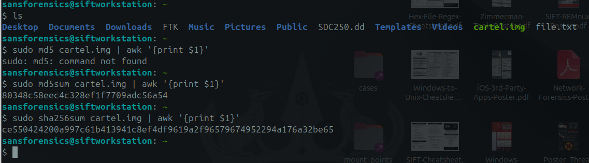</p>

*Figure 1.1 — Terminal output of hash calculation against cartel.img.*

The compressed original image is included in this repository at [`evidence/cartel.rar`](evidence/cartel.rar); anyone can extract it and re-run `md5sum` / `sha256sum` against it to confirm it matches the values above before re-running any command in this report. Every file recovered by foremost, plus the manually-carved diary fragment, is included unmodified in [`recovered/`](recovered/), alongside the original [`audit.txt`](recovered/audit.txt) carving log.

# **🔎 3. Overview**

The examination followed the four-phase NIST SP 800-86 methodology: Collection, Examination, Analysis, and Reporting. All work was performed against a working copy of the supplied image; the original image file was never modified.

**Examination Workflow**

```
IDENTIFICATION
Case intake, evidence seizure record
        |
        v
PRESERVATION
Hash verification (MD5 / SHA-256) before and after
        |
        v
COLLECTION
Working copy created; original image never touched
        |
        v
EXAMINATION
Image format, partition layout, file system (Task 2)
        |
        v
ANALYSIS
Allocated files, wipe regions, carved data, hash correlation (Tasks 3–4)
        |
        v
REPORTING
Timeline reconstruction, findings, conclusions (Task 5)
```

# **🎯 4. Objectives**

- Verify and preserve the integrity of the forensic image throughout examination
- Determine the image format, partition layout, and file system
- Identify all allocated files and assess them against the suspect's stated claim
- Detect and characterize any anti-forensic activity (wiping, pattern-fill)
- Recover data from unallocated space via signature-based carving
- Correlate recovered artefacts (hash comparison, content cross-reference)
- Reconstruct a timeline to the extent the surviving evidence allows
- Produce a professional forensic examination report

# **📐 5. Scope & Limitations**

**Scope:**

- One forensic image (cartel.img) supplied as a working copy; no live acquisition performed
- Filesystem-level examination (The Sleuth Kit: mmls, fsstat, fls, istat, icat, blkls)
- Signature-based file carving of unallocated space (Foremost, Binwalk)
- Cryptographic hashing for integrity verification and duplicate-file correlation (MD5/SHA-256)
- Metadata extraction from recovered documents and images (ExifTool, catdoc, strings)

**Limitations:**

- Recovery was limited to signature-based file carving; carved files have no associated filesystem metadata (no MAC timestamps, no original filenames) because their directory entries no longer exist
- The two large wipe regions could not be reversed
- No hidden partitions, encrypted containers, or host-protected areas were identified
- The only two reliable timestamps on the volume (30 April 2004) predate the 2 August 2026 seizure by over two decades and cannot be independently corroborated from this image alone
- No content directly and unambiguously tying the device to drug-trafficking ("cartel") activity was recovered in the areas examined — this does not rule such content in or out, given the scale of the wipe

# **🛠️ 6. Tools Used**

| Tool                                                           | Purpose                                                          |
| -------------------------------------------------------------- | ------------------------------------------------------------------ |
| The Sleuth Kit (mmls, fsstat, fls, istat, icat, blkls) v4.12.1 | Filesystem-level triage, allocated-file listing, metadata        |
| Foremost v1.5.7                                                | Signature-based file carving of unallocated space                |
| Binwalk                                                        | File-signature scanning of unallocated space                     |
| md5sum / sha256sum (GNU coreutils)                             | Evidence integrity hashing; duplicate-file correlation           |
| ExifTool v12.76                                                | Metadata extraction from recovered documents/images              |
| Python 3                                                       | Custom pattern/offset analysis (wipe-region boundary detection)  |
| file, strings, catdoc (GNU binutils)                           | File-type identification; raw text extraction from OLE2 document |

# **⚙️ 7. Methodology**

- Identification
- Preservation
- Collection
- Examination
- Analysis
- Reporting

**Phase Status:** Identification ✅ · Preservation ✅ · Collection ✅ · Examination ✅ · Analysis ✅ · Reporting ✅

# **🔬 8. Findings**

**A. Initial Triage — Image Format & File System (Task 2)**

| Property               | Value                                                           |
| ---------------------- | ----------------------------------------------------------------- |
| Image format           | Raw (dd-style) disk image                                       |
| File system type       | FAT16                                                           |
| Number of partitions   | 0 — no MBR partition table (unpartitioned "superfloppy" volume) |
| Total size             | 259,506,176 bytes (≈ 247.5 MB)                                  |
| Sector size            | 512 bytes                                                       |
| Cluster size           | 4,096 bytes (8 sectors)                                         |
| OEM name (boot sector) | mkdosfs — Linux dosfstools utility                              |
| Volume serial number   | 0x4092D9D1                                                      |
| Volume label           | (none set)                                                      |

<p align="center">
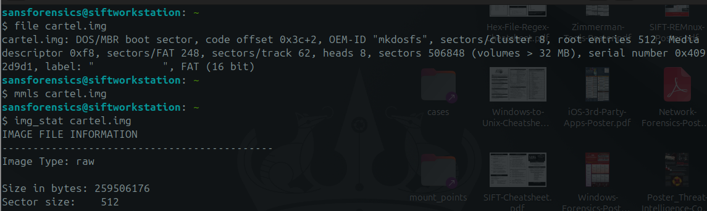
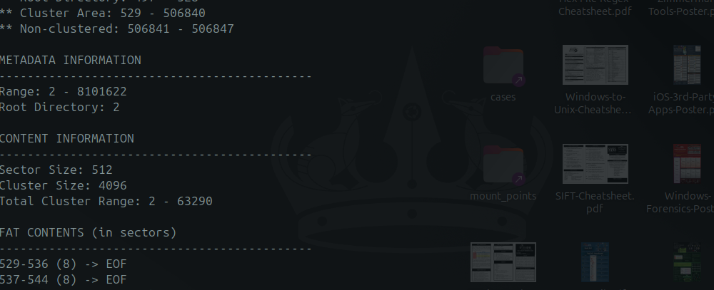
</p>

*Figure 2.1 — mmls output confirming partition layout. Figure 2.3 — fsstat output confirming file system.*

**B. Allocated Files — Artifact 1: GUMBO1.TXT and GUMBO2.TXT**

Description: The only two files allocated in the FAT16 directory structure at the time of seizure. Both are plain-text recipes ("Shrimp and Tasso Gumbo"-style content), sized 2,815 and 1,293 bytes, both Written/Created 2004-04-30 18:11:20–18:11:24 (UTC).

Relevance: This is the entire visible content of the device as presented to a normal user. It directly contradicts the suspect's specific claim that the device "only contains personal photographs."

<p align="center">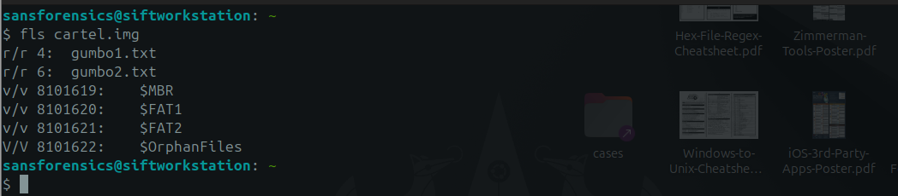</p>

*Figure 3.1 — fls recursive listing showing the only two allocated files on the volume.*

**C. Wipe Regions — Artifact 2: Large-scale ASCII pattern-fill**

Description: Two contiguous blocks of repeating, human-readable ASCII text fill the vast majority of the volume's data area: ~54.5 MB of repeating "SORRY" (offsets ~273,920–54,735,350) immediately followed by ~148.5 MB of repeating "CHARLIE" (offsets 54,735,360–203,186,168). Together these span roughly 208 MB — over 80% of the 247.5 MB device.

Relevance: A deliberate, repeating, non-zero, non-random fill pattern of this scale is not a byproduct of normal use — it is consistent with an intentional wipe/overwrite operation intended to destroy prior data before the device was seized.

<p align="center">
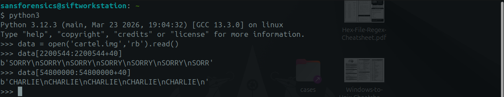
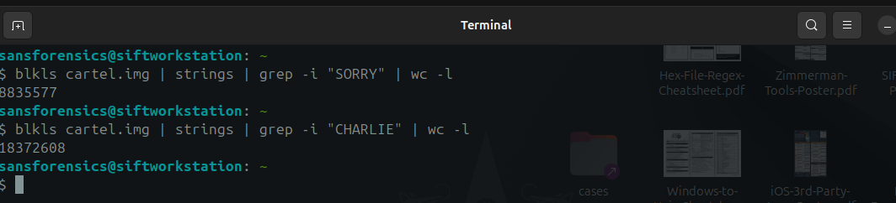
</p>

*Figure 3.4 — Confirmation of the SORRY pattern-fill region. Figure 3.5 — Confirmation of the CHARLIE pattern-fill region.*

**D. Recovered Photographic Images — surviving "island" (Artifact 3)**

Description: A ~1.5 MB region (offsets ~53,277,184–54,735,360), between the end of the allocated files' cluster area and the start of the SORRY/CHARLIE wipe blocks, was not overwritten. Six JPEG images and two GIF images were carved from this region using Foremost after Binwalk flagged the signatures.

| File           | Content                                                                                 | Notes                                                     |
| -------------- | ----------------------------------------------------------------------------------------- | ------------------------------------------------------------ |
| [`00104057.jpg`](recovered/00104057.jpg) | American alligator, close-up                                                            | Embedded comment "copyright 2000 <philg@mit.edu>"         |
| [`00104249.jpg`](recovered/00104249.jpg) | Alligator swimming at water surface                                                     | No EXIF/GPS/camera data                                   |
| [`00105065.jpg`](recovered/00105065.jpg) | Alligator sunning on landscaped rock/mulch bed                                          | No EXIF/GPS/camera data                                   |
| [`00105873.jpg`](recovered/00105873.jpg) | Baby alligator hatching from egg, held in a hand, watermarked "ALLIGATOR HATCHING 2004" | **Duplicate of `00335081.jpg` — see Group F**             |
| [`00106393.jpg`](recovered/00106393.jpg) | Black rhinoceros, small close-up photo                                                  | 6 KB thumbnail; embedded "LEAD Technologies Inc." comment |
| [`00106409.jpg`](recovered/00106409.jpg) | White rhino and calf drinking at a waterhole                                            | No EXIF/GPS/camera data                                   |
| [`00106865.gif`](recovered/00106865.gif) | Pen-and-ink style illustration of a rhino                                               | 290×246                                                   |
| [`00106889.gif`](recovered/00106889.gif) | Simple blue cartoon/clip-art rhino icon                                                 | 150×87                                                    |

None of the alligator or rhino images carry camera EXIF data, GPS coordinates, or device make/model — consistent with images sourced from the web (stock photography, clip art, and reference imagery) rather than personal photographs taken by the suspect.

<p align="center">
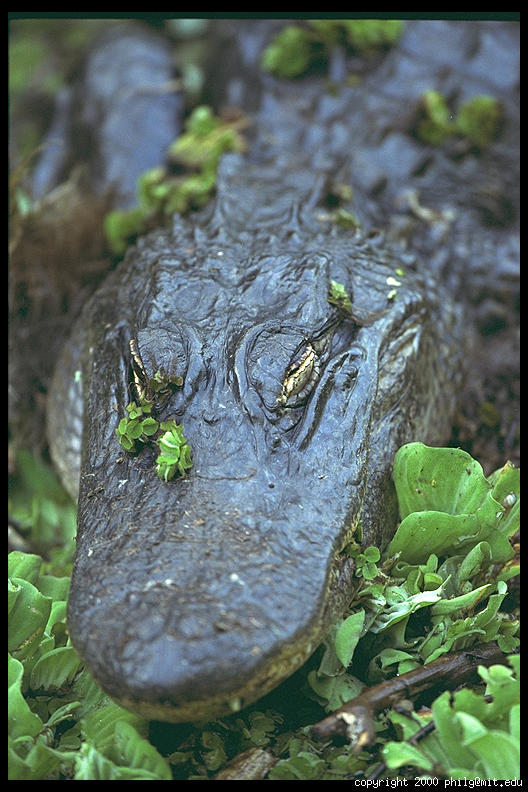
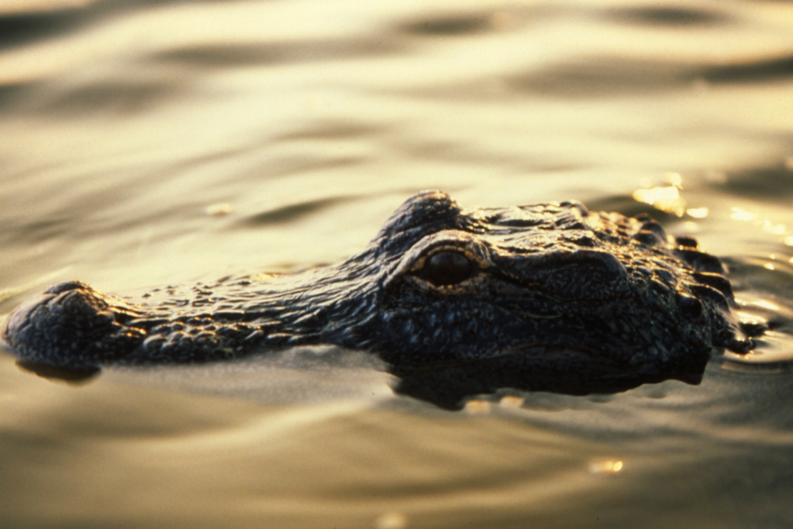
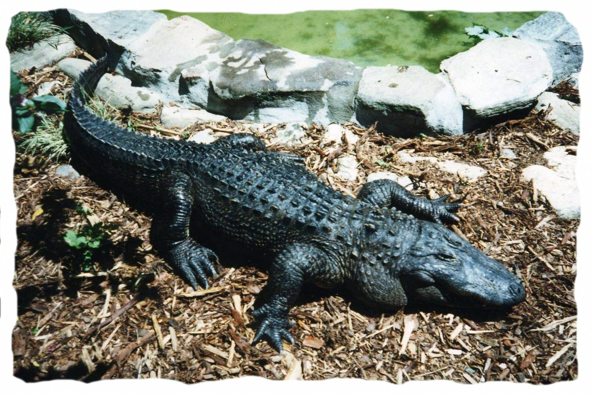
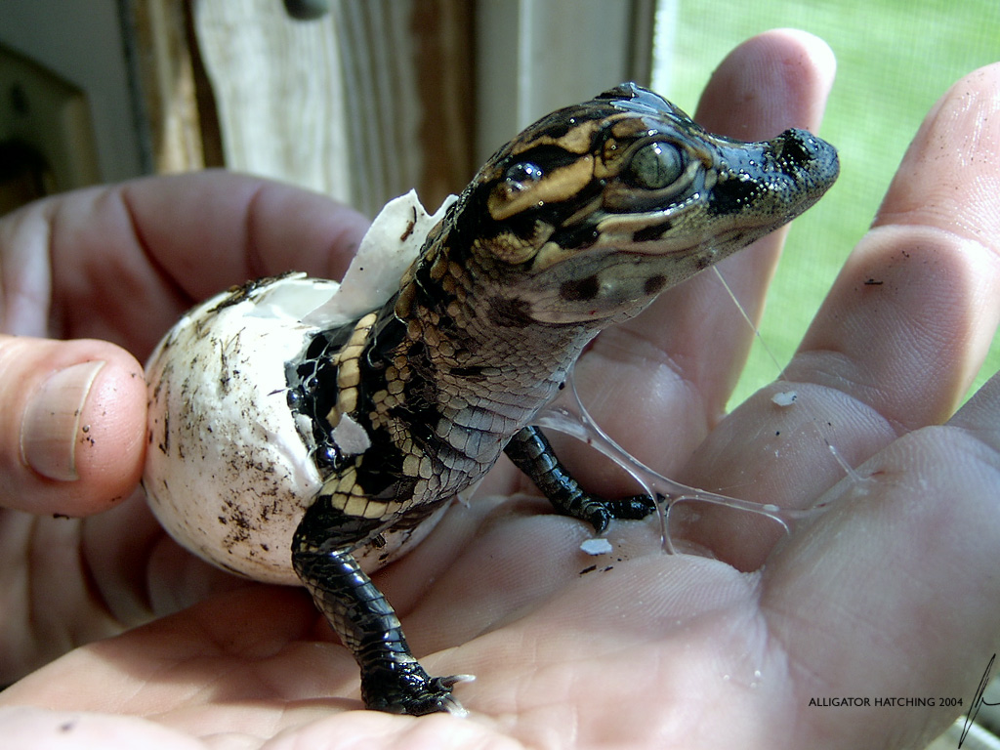
</p>
<p align="center"><em>Recovered alligator images: 00104057.jpg, 00104249.jpg, 00105065.jpg, 00105873.jpg.</em></p>

<p align="center">
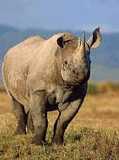
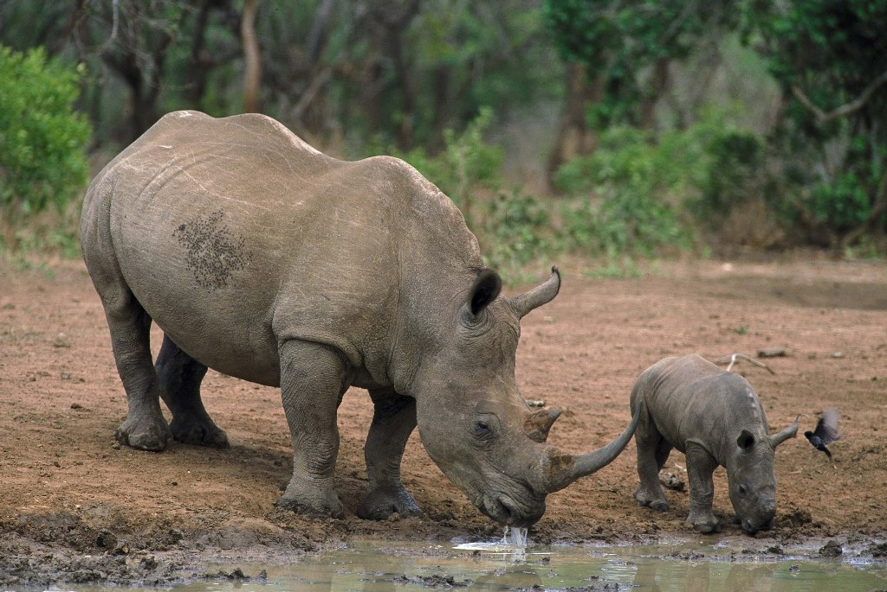
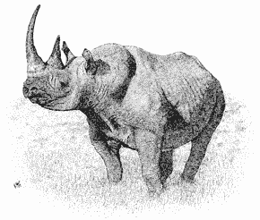

</p>
<p align="center"><em>Recovered rhino images: 00106393.jpg, 00106409.jpg, 00106865.gif, 00106889.gif.</em></p>

**E. Recovered Microsoft Word Document (Artifact 4 / Recovered File 1: [`00335017.doc`](recovered/00335017.doc))**

Description: A Microsoft Word 97–2003 (OLE2 Compound Document) file, ~11 MB as carved, recovered from offset 171,528,704 inside the CHARLIE-wiped region.

Internal metadata: Title "She died in February at the age of 74"; Author/Last Modified By "NO WAY MAN NO WAY MAN NOWAY."; Company "University of New Orleans"; Created and Last Saved 9 August 2005.

Significance: The single most significant recovered artefact. Its first-person body text includes:

> *"...I zapped the hard drive and then threw it into the Mississippi River. I'm gonna reformat my USB key after this entry, but try not to destroy the good stuff..."*

— directly explaining the SORRY/CHARLIE wipe pattern (Group C). A second passage:

> *"Rhino pictures illegal? Makes me sick. I 'hid' the photos..."*

— now directly confirmed against actual recovered content: the four rhino-themed files in Group D ([`00106393.jpg`](recovered/00106393.jpg), [`00106409.jpg`](recovered/00106409.jpg), [`00106865.gif`](recovered/00106865.gif), [`00106889.gif`](recovered/00106889.gif)) are exactly the category of image this passage references.

<p align="center">
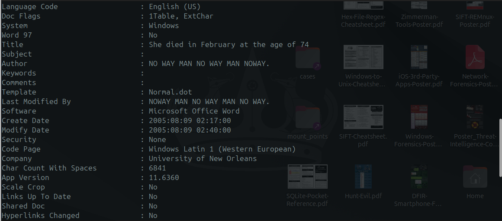
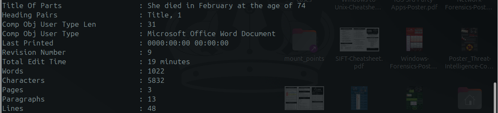
</p>

*Figure 4.1b — Body-text excerpt referencing the destroyed hard drive. Figure 4.1c — Body-text excerpt referencing hidden rhino photos.*

**F. Duplicate File via Hash Comparison (Artifact 5)**

Description: SHA-256 hashing of every recovered file showed [`00105873.jpg`](recovered/00105873.jpg) (offset 54,206,976) and [`00335081.jpg`](recovered/00335081.jpg) (offset 171,561,472) — over 117 MB apart on the disk — are byte-for-byte identical (SHA-256: `f92654d9ee17ab6b684b09de01cf0bc4076383c007964946d3f31577447596fb`). Re-verified directly against the actual recovered files in this repository — the hashes match exactly. Both files are the same "alligator hatching" photograph.

**G. Consolidated Recovered-File Inventory (Task 4)**

Foremost's carving run extracted 10 files (numbered 0–9); a further file (`diary_fragment.txt`, referenced in Group E's body text) was manually carved from a printable-text run inside the CHARLIE region.

| Filename             | Type       | Size        | Offset                  | Note                                                          |
| --------------------- | ---------- | ----------- | ------------------------ | ---------------------------------------------------------------- |
| [`00335017.doc`](recovered/00335017.doc)       | DOC (OLE2) | ~11 MB      | 171,528,704             | Diary-style document — see Group E                            |
| [`00104057.jpg`](recovered/00104057.jpg)       | JPEG       | 93 KB       | 53,277,184              | Alligator close-up, "copyright 2000 <philg@mit.edu>"          |
| [`00104249.jpg`](recovered/00104249.jpg)       | JPEG       | 405 KB      | 53,375,488              | Alligator swimming                                            |
| [`00105065.jpg`](recovered/00105065.jpg)       | JPEG       | 401 KB      | 53,793,280              | Alligator sunning on rocks                                    |
| [`00105873.jpg`](recovered/00105873.jpg)       | JPEG       | 258 KB      | 54,206,976              | Alligator hatching — duplicate of `00335081.jpg`, see Group F |
| [`00106393.jpg`](recovered/00106393.jpg)       | JPEG       | 6 KB        | 54,473,216              | Rhino thumbnail, "LEAD Technologies" comment                  |
| [`00106409.jpg`](recovered/00106409.jpg)       | JPEG       | 225 KB      | 54,481,408              | Rhino and calf at waterhole                                   |
| [`00106865.gif`](recovered/00106865.gif)       | GIF        | 11 KB       | 54,714,880              | Rhino sketch illustration, 290×246                            |
| [`00106889.gif`](recovered/00106889.gif)       | GIF        | 4 KB        | 54,727,168              | Cartoon rhino icon, 150×87                                    |
| [`00335081.jpg`](recovered/00335081.jpg)       | JPEG       | 258 KB      | 171,561,472             | Alligator hatching — duplicate of `00105873.jpg`, see Group F |
| `diary_fragment.txt` | Text       | 6,278 bytes | 171,531,840–171,538,118 | Manually carved; text matches `00335017.doc`                  |

**H. Timeline Reconstruction (Task 5)**

<p align="center">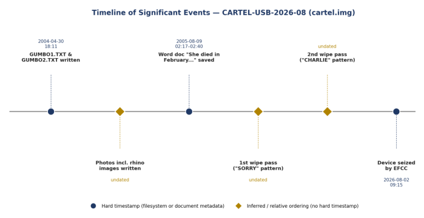</p>

*Timeline diagram — sequence of events reconstructed from hard timestamps and relative disk-layout inference.*

| Order | Event                                                    | Timestamp / Basis                                      | Evidence Type                            |
| ----- | ---------------------------------------------------------- | ---------------------------------------------------------- | ------------------------------------------- |
| 1     | GUMBO1.TXT written                                       | 2004-04-30 18:11:20 (UTC)                              | Hard timestamp (FAT metadata)            |
| 2     | GUMBO2.TXT written                                       | 2004-04-30 18:11:24 (UTC)                              | Hard timestamp (FAT metadata)            |
| 3     | Photographs (Group D) written                            | Undated — inferred to predate SORRY wipe               | Relative position, no hard timestamp     |
| 4     | First wipe pass ("SORRY")                                | Undated — inferred after item 3, before item 5         | Content/pattern analysis                 |
| 5     | Diary text + duplicate JPEG (Groups E–F) written/present | Undated — diary text describes a prior, separate drive | Content analysis (self-referential text) |
| 6     | Second wipe pass ("CHARLIE")                             | Undated — inferred after item 5                        | Relative position, partial overwrite     |
| 7     | Device seized by EFCC                                    | 2026-08-02, 09:15 AM                                   | Case background (chain of custody)       |

# **🚨 9. Indicators & Anti-Forensic Techniques**

| Indicator                                                                                                             | Type                                                           | Source  | MITRE ATT&CK® Mapping                                                                           |
| -------------------------------------------------------------------------------------------------------------------------- | ------------------------------------------------------------------ | ------- | ------------------------------------------------------------------------------------------------- |
| Two-pattern wipe ("SORRY" then "CHARLIE"), ~208 MB / >80% of volume                                                   | Anti-forensic wipe                                             | Group C | [T1485: Data Destruction](https://attack.mitre.org/techniques/T1485/)                           |
| Diary text explicitly describing destruction of a separate prior drive                                                | Self-admission / corroborating text                            | Group E | [T1485: Data Destruction](https://attack.mitre.org/techniques/T1485/) (corroborating statement) |
| No FAT directory entries survive for any carved file (10 items)                                                       | Evidence of directory-entry removal preceding/via wipe         | Group G | [T1070.004: Indicator Removal — File Deletion](https://attack.mitre.org/techniques/T1070/004/)  |
| Rhino-themed images matching the diary's "hid the photos" reference, presented against a "personal photographs" claim | Content misrepresentation (case-relevant, not malware-related) | Group D | Not applicable — ATT&CK does not cover suspect statements; noted for case relevance only        |
| SHA-256 duplicate file across two widely-separated, pre-wipe offsets                                                  | Corroborating timeline indicator                               | Group F | Not applicable — forensic correlation technique                                                 |

# **🔗 10. Correlation**

- The wipe (Group C) and the diary text (Group E) corroborate each other: the diary describes zapping a hard drive and stating intent to reformat "my USB key" — matching, in kind, the two-pattern wipe found on this exact device.
- The diary's rhino reference is now directly corroborated by content, not just by theme: the passage "Rhino pictures illegal? ... I 'hid' the photos" sits alongside four actual rhino-themed images ([`00106393.jpg`](recovered/00106393.jpg), [`00106409.jpg`](recovered/00106409.jpg), [`00106865.gif`](recovered/00106865.gif), [`00106889.gif`](recovered/00106889.gif)) recovered from the same device — a specific, verifiable match between the document's stated content and the surviving image files, not a coincidental thematic overlap.
- The duplicate JPEG (Group F) — confirmed byte-for-byte identical against the actual recovered files — sits on both sides of the SORRY/CHARLIE boundary in time: [`00105873.jpg`](recovered/00105873.jpg) is in the pre-wipe surviving island (Group D), and its identical twin [`00335081.jpg`](recovered/00335081.jpg) sits inside the CHARLIE region alongside the Word document (Group E).
- The allocated files (Group B) and the recovered images (Group D) are jointly inconsistent with the suspect's claim, but for different reasons: Group B shows the visible content isn't photographs at all, while Group D shows the recovered photographs that do exist are alligator/rhino stock and clip-art imagery, not personal photographs of the suspect.
- The foremost carving log (10 files extracted, confirmed against the included [`audit.txt`](recovered/audit.txt)) and the Executive Summary's original "nine files" figure disagree — see Section 14, Challenges & Solutions.

# **📊 11. Assessment**

Based on the correlated findings above, it is assessed with high confidence that the suspect's claim that the device "only contains personal photographs" is not supported by the evidence: the only allocated files are recipe documents, and the recovered images are alligator- and rhino-themed stock/clip-art imagery with no identifying EXIF, GPS, or camera data.

Independently of that claim, it is assessed with high confidence that the volume was subject to a deliberate, large-scale data-destruction operation (Group C), and that a surviving first-person text fragment (Group E) — recovered from within the wiped area — describes the same author destroying a separate prior drive, stating intent to reformat this device, and explicitly referencing hiding rhino photographs that match the actual rhino images recovered from this device (Group D). This is a rare case where the anti-forensic actor's own contemporaneous account of the act survives alongside both the physical evidence of the act and the specific content it references.

No content directly and unambiguously tying the device to drug-trafficking ("cartel") activity was recovered in the areas examined; however, the scale of the wipe means a substantial volume of prior data cannot be ruled in or out. This report draws no conclusion as to guilt or innocence.

# **⚠️ 12. Risk / Evidentiary Analysis**

| Finding                                                                                | Confidence                                                        | Case Relevance                                        | Overall Weight | MITRE ATT&CK®                                       |
| ------------------------------------------------------------------------------------------ | ----------------------------------------------------------------------- | ---------------------------------------------------------- | -------------- | ------------------------------------------------------- |
| Deliberate two-pattern wipe covering >80% of volume                                    | High (statistical: 8.8M+ / 18.3M+ pattern occurrences)            | High — establishes anti-forensic intent               | High           | [T1485](https://attack.mitre.org/techniques/T1485/) |
| Diary text describing destruction of a separate drive + intent to reformat this device | High (coherent, first-person, matches document metadata)          | High — direct corroboration of wipe intent            | High           | [T1485](https://attack.mitre.org/techniques/T1485/) |
| Allocated files are recipes, not photographs                                           | Confirmed (filesystem fact)                                       | High — directly contradicts suspect's specific claim  | High           | Not applicable                                      |
| Recovered images are alligator/rhino stock imagery, matched to diary text content      | High (embedded comments + direct content match to diary passage)  | Medium — undermines "personal photographs" framing    | Medium         | Not applicable                                      |
| SHA-256 duplicate file across wipe boundary                                            | Confirmed (cryptographic match, re-verified against actual files) | Medium — supports timeline sequencing only            | Low–Medium     | Not applicable                                      |
| No content unambiguously tying device to drug trafficking                              | N/A (absence of evidence)                                         | Undetermined — cannot rule in or out given wipe scale | Informational  | Not applicable                                      |

# **💡 13. Recommendations**

- Submit recovered JPEGs/GIFs for reverse-image-search comparison to confirm their stock/clip-art origin (the alligator images' "<philg@mit.edu>" and "LEAD Technologies" comments are a strong starting point).
- Request any related devices — the "hard drive... thrown into the Mississippi River" referenced in the recovered diary text — if within scope of the wider investigation.
- If further budget/time is available, engage advanced carving (e.g. PhotoRec with fragment-recovery heuristics) against the two wipe regions in case of partially-missed clusters.
- Obtain the suspect's host computer(s) to correlate USB connection artefacts with this device's serial number (0x4092D9D1) and to help resolve the 2004 timestamp anomaly.

# **🧩 14. Challenges & Solutions**

- The original foremost carving run initially missed the Word document ([`00335017.doc`](recovered/00335017.doc)) because the "doc" rule is commented out by default in `/etc/foremost.conf`. Resolved by enabling it and re-running the carve.
- The Executive Summary's original headline figure ("nine files") was not updated after the corrected carving run recovered a tenth file (the Word document) and its duplicate JPEG twin. This version resolves that by stating the corrected total explicitly (Group G: 10 carved files + 1 manually-carved text fragment = 11 items).
- Distinguishing a deliberate wipe from an incidental quick-format required full-image regex scanning (SORRY: 8,835,577 occurrences; CHARLIE: 18,372,608 occurrences), not just sampling.
- The diary text and the Word document were originally described in two separate places; this version merges them into a single Group E entry.
- No signature-based carver targets unstructured plain text, so the diary fragment required manual offset-based identification rather than automated carving.
- Until the actual recovered files were reviewed, the images in Group D could only be described generically ("stock/generic imagery"). With the real files now in hand, the specific alligator/rhino content is documented precisely, and the rhino images are directly matched against the diary's "hid the photos" passage rather than left as a thematic guess.

# **🎓 15. Skills Demonstrated**

**Digital Forensics Methodology**

- NIST SP 800-86 four-phase methodology (Collection, Examination, Analysis, Reporting)
- Evidence integrity practices (MD5/SHA-256 hashing, chain of custody)
- Filesystem-level triage and metadata interpretation (FAT16)

**Data Recovery & Carving**

- Signature-based file carving (Foremost, Binwalk)
- Manual offset-based carving for unstructured plain text
- Recognition and precise boundary-mapping of anti-forensic wipe patterns

**Evidence Correlation & Analysis**

- Cryptographic hash-based duplicate-file correlation
- Cross-artefact content correlation (diary text ↔ recovered document ↔ recovered images)
- MITRE ATT&CK® mapping of anti-forensic technique indicators
- Constrained timeline reconstruction from partial, non-absolute evidence

**Reporting**

- Executive-summary-led, evidence-linked reporting
- Explicit scope/limitations statement
- Transparent handling of source-material inconsistencies rather than silent correction

# **📚 16. Reference**

- [The Sleuth Kit](https://www.sleuthkit.org/) · [Foremost](http://foremost.sourceforge.net/) · [Binwalk](https://github.com/ReFirmLabs/binwalk)
- NIST SP 800-86, Guide to Integrating Forensic Techniques into Incident Response
- [MITRE ATT&CK®](https://attack.mitre.org/) — `T1485`, `T1070.004`
- [`recovered/audit.txt`](recovered/audit.txt) — original foremost carving log, included in this repository
